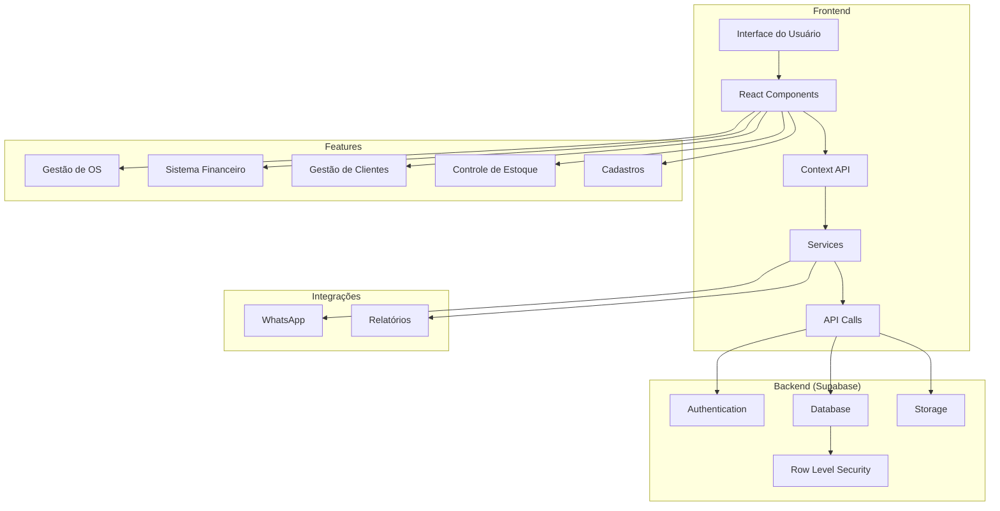

# Sistema de Gestão de Sapataria - Documentação

## Visão Geral

O Sistema de Gestão de Sapataria é uma aplicação web completa desenvolvida para gerenciar todos os aspectos de uma sapataria, desde o controle de ordens de serviço até a gestão financeira. O sistema foi construído com tecnologias modernas e oferece uma interface intuitiva e responsiva.

## Arquitetura do Sistema

O sistema segue uma arquitetura moderna baseada em componentes, utilizando React no frontend e Supabase como backend. Abaixo está o diagrama da arquitetura:



### Componentes Principais

1. **Frontend**
   - Interface do Usuário: Construída com React e TailwindCSS
   - Components: Componentes reutilizáveis e modulares
   - Context API: Gerenciamento de estado global
   - Services: Camada de serviços para lógica de negócios
   - API Calls: Comunicação com o backend

2. **Backend (Supabase)**
   - Authentication: Sistema de autenticação e autorização
   - Database: Banco de dados PostgreSQL
   - Storage: Armazenamento de arquivos
   - Row Level Security: Políticas de segurança por linha

3. **Features**
   - Módulos principais do sistema
   - Cada módulo é independente mas integrado
   - Comunicação via Context API

4. **Integrações**
   - WhatsApp: Comunicação com clientes
   - Relatórios: Geração e exportação de dados

## Tecnologias Utilizadas

### Frontend
- React 
- TypeScript
- TailwindCSS (para estilização)
- Lucide Icons (para ícones)
- Recharts (para gráficos)

### Backend
- Supabase (Backend as a Service)
  - Autenticação
  - Banco de dados PostgreSQL
  - Armazenamento de arquivos
  - Row Level Security (RLS)

## Funcionalidades Principais

### 1. Gestão de Ordens de Serviço
- Criação e edição de OS
- Acompanhamento de status
- Registro de serviços realizados
- Controle de pagamentos
- Histórico de alterações

### 2. Gestão de Clientes
- Cadastro completo de clientes
- Histórico de serviços
- Controle de créditos e débitos
- Integração com WhatsApp para comunicação

### 3. Sistema Financeiro
#### 3.1 Fluxo de Caixa
- Registro de receitas e despesas
- Categorização de transações
- Controle de formas de pagamento
- Saldo em tempo real
- Relatórios diários/mensais

#### 3.2 Contas a Pagar/Receber
- Gestão de contas a pagar
- Controle de contas a receber
- Agendamento de pagamentos
- Notificações de vencimentos

#### 3.3 Relatórios Financeiros
- Dashboard com indicadores
- Gráficos de desempenho
- Análise de receitas/despesas
- Exportação de relatórios

### 4. Gestão de Estoque
- Controle de produtos
- Gestão de fornecedores
- Alertas de estoque baixo
- Histórico de movimentações

### 5. Cadastros
- Funcionários
- Serviços
- Produtos
- Fornecedores
- Formas de pagamento
- Bancos

## Estrutura do Projeto

```
src/
├── components/           # Componentes React
│   ├── auth/            # Componentes de autenticação
│   ├── cadastros/       # Telas de cadastros
│   ├── clients/         # Gestão de clientes
│   ├── finance/         # Sistema financeiro
│   ├── layout/          # Componentes de layout
│   ├── orders/          # Gestão de OS
│   ├── reports/         # Relatórios
│   └── shared/          # Componentes compartilhados
├── context/             # Contextos React
├── services/            # Serviços e integrações
├── types/               # Tipos TypeScript
└── utils/              # Funções utilitárias
```

## Configuração do Ambiente

### Pré-requisitos
- Node.js (v16 ou superior)
- npm ou yarn
- Conta no Supabase

### Instalação

1. Clone o repositório:
```bash
git clone [URL_DO_REPOSITÓRIO]
cd [NOME_DO_PROJETO]
```

2. Instale as dependências:
```bash
npm install
# ou
yarn install
```

3. Configure as variáveis de ambiente:
- Crie um arquivo `.env` na raiz do projeto
- Adicione as seguintes variáveis:
```env
VITE_SUPABASE_URL=sua_url_do_supabase
VITE_SUPABASE_ANON_KEY=sua_chave_anonima_do_supabase
```

4. Inicie o servidor de desenvolvimento:
```bash
npm run dev
# ou
yarn dev
```

## Banco de Dados

### Tabelas Principais

1. `orders` - Ordens de serviço
2. `clients` - Clientes
3. `services` - Serviços disponíveis
4. `products` - Produtos
5. `financial_transactions` - Transações financeiras
6. `bills` - Contas a pagar
7. `employees` - Funcionários
8. `suppliers` - Fornecedores

### Políticas de Segurança (RLS)
O sistema utiliza Row Level Security do Supabase para garantir que:
- Cada usuário só veja os dados pertinentes ao seu perfil
- Transações financeiras só podem ser modificadas por usuários autorizados
- Dados sensíveis são protegidos adequadamente

## Fluxos de Trabalho

### 1. Criação de Ordem de Serviço
1. Selecionar/cadastrar cliente
2. Preencher informações do artigo
3. Selecionar serviços
4. Definir valores e forma de pagamento
5. Registrar entrada/pagamento
6. Gerar OS

### 2. Gestão Financeira
1. Registro de transações
2. Categorização
3. Conciliação com caixa físico
4. Geração de relatórios
5. Análise de indicadores

### 3. Controle de Estoque
1. Cadastro de produtos
2. Registro de entradas/saídas
3. Controle de fornecedores
4. Alertas de estoque

## Manutenção e Suporte

### Backups
- O Supabase realiza backups automáticos
- Recomenda-se exportar dados críticos periodicamente

### Monitoramento
- Logs de transações
- Registro de atividades
- Alertas de erros

### Atualizações
1. Backup dos dados
2. Atualização do código
3. Testes de regressão
4. Deploy da nova versão

## Boas Práticas

### Código
- Seguir padrões de TypeScript
- Documentar funções complexas
- Manter componentes pequenos e focados
- Usar tipos explícitos

### Segurança
- Nunca expor chaves de API
- Validar inputs do usuário
- Manter dependências atualizadas
- Seguir princípio do menor privilégio

### Performance
- Otimizar consultas ao banco
- Lazy loading de componentes
- Caching quando apropriado
- Monitorar tempos de resposta

## Suporte

Para suporte técnico ou dúvidas:
1. Consulte esta documentação
2. Verifique os logs de erro
3. Entre em contato com a equipe de desenvolvimento

## Contribuição

1. Fork o projeto
2. Crie uma branch (`git checkout -b feature/AmazingFeature`)
3. Commit suas mudanças (`git commit -m 'Add some AmazingFeature'`)
4. Push para a branch (`git push origin feature/AmazingFeature`)
5. Abra um Pull Request

## Licença

Este projeto está sob a licença MIT. Veja o arquivo [LICENSE](../LICENSE) para mais detalhes.